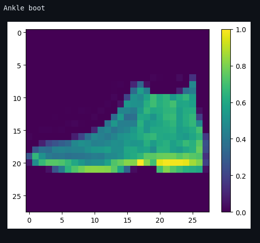

<h1>Multiple Datasets Prediction using Tensorflow in Python on FreeCodeCamp</h1>
 
<h2>Features</h2>
<li>Core Algorithms</li>
<li>Training the feature columns</li>
<li>The training process - Input Function</li>
<li>Creating and Training the model</li>
<li>Dictionary of predictions</li>
<li>Classification</li>
<li>Build a DNN with 2 hidden layers (30 and 10 hidden nodes each)</li>
<li>Input Function</li>
<li>Building, training & testing the model</li>
<li>Predictions</li>
<li>Clustering</li>
<li>Create the hidden markov model</li>
<li>K-Means Clustering </li>
<li>Neural Networks</li>
<li>Dataset includes 60.000 images for training and 10.000 images for testing</li>
<li>Create an array of label names to indicate which is which</li>
<li>10 images examples </li>
<li>Data Preprocessing</li>
<li>Creating the Model</li>
<li>Compile the Model</li>
<li>Training the Model</li>
<li>Testing the Model</li>
<li>Making Predictions</li>
<li>Type a number and show the image, expected and guess the clothes</li>
<li>Deep Computer Vision</li>
<li>Convolutional Neural Network</li>
<li>CIFAR Image Dataset (60.000 images with 32x32 color images with 6000 images of each class)</li>
<li>CNN Arhitecture (define the layers)</li>
<li>Adding dense layers</li>
<li>Working with Small Datasets</li>
<li>Data Augmentation</li>
<li>Pretrained Models</li>
<li>All images will be resized to 160x160</li>
<li>Suffle amd batch the images</li>
<li>Original image vs the new image</li>
<li>Picking a Pretrained Model</li>
<li>Create the base model from the pre-trained model MobileNet V2</li>
<li>Freezing the Base</li>
<li>Natural Language Processing</li>
<li>Bag of Words</li>
<li>Sentiment Analysis / Movie Review Dataset</li>
<li>RNN Play Generator</li>
<li>Loading Your Own Data</li>
<li>Read Contents of File</li>
<li>Encoding to integers</li>
<li>Convert numeric values to text</li>
<li>Creating Training Examples (input Hell, output: ello, predict the last character)</li>
<li>Batch method</li>
<li>Creating a Loss Function</li>
<li>Creating Checkpoints</li>
<li>Generating Text</li>
<li>Reinforcement Learning wiht Q-Learning</li>
<li>Open AI Gym Module by Elon Musk</li>
<li>Building the Q-Table</li>
<li>Picking an Action</li>
<li>Updating Q Values</li>

<h2>Acknowledgments</h2>

<b> Python3: http://bit.ly/python3-certifications <b>
 
<b> Machine Learning: https://bit.ly/machine-learning-certification <b>

<h2>Links</h2>
<b>FreeCodeCamp: https://www.freecodecamp.org/learn/machine-learning-with-python/</b>
 

<h2>Photo</h2>

 

<h2>Contact</h2>

<b> Email: mariusc0023@gmail.com </b>
